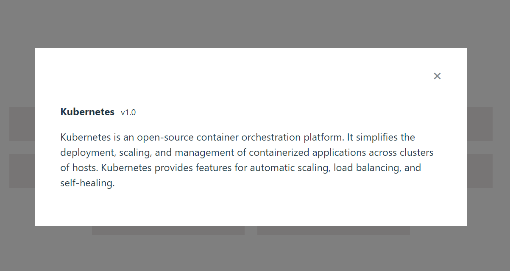

# Kubernetes Playground

This repository showcases a Kubernetes implementation that utilizes Docker files and Docker Compose for the React and Node.js applications, alongside Kubernetes manifest files stored in a dedicated **k8s** folder for streamlined deployment and orchestration.

## Running the app via docker-compose

Prerequisite: Docker

1. Navigate to **apps** directory and execute the following command.
   ```bash
   docker-compose up -d
   ```
1. You can access the web app via http://localhost:3000
   
1. Clicking on one of the services will trigger the display of its description..
   
1. In case an error message appears when clicking on a service, please verify the server's port number or modify the **VITE_API_URL** environment

   

## Running the app using Kubernetes

Prerequisite: Minikube, kubectl

1. Navigate to **k8s** directory and execute the following command.

   ```bash
   # make sure shell script is executable
   chmod +x ./deploy.sh

   # run minikube tunnel on another terminal to expose the load balancer external ip
   minkikube tunnel

   # deploy the application
   ./deploy.sh

   # get the service ip
   kubectl get svc
   ```

1. The app can be accessed by using `<cloud-client_external-ip>:<port>`, For instance: `127.0.0.1:3000`
1. You should see the app displayed similarly to the images above.
1. To delete the apps execute the following command.

   ```bash
   chomd +x ./delete.sh && ./delete.sh
   ```
